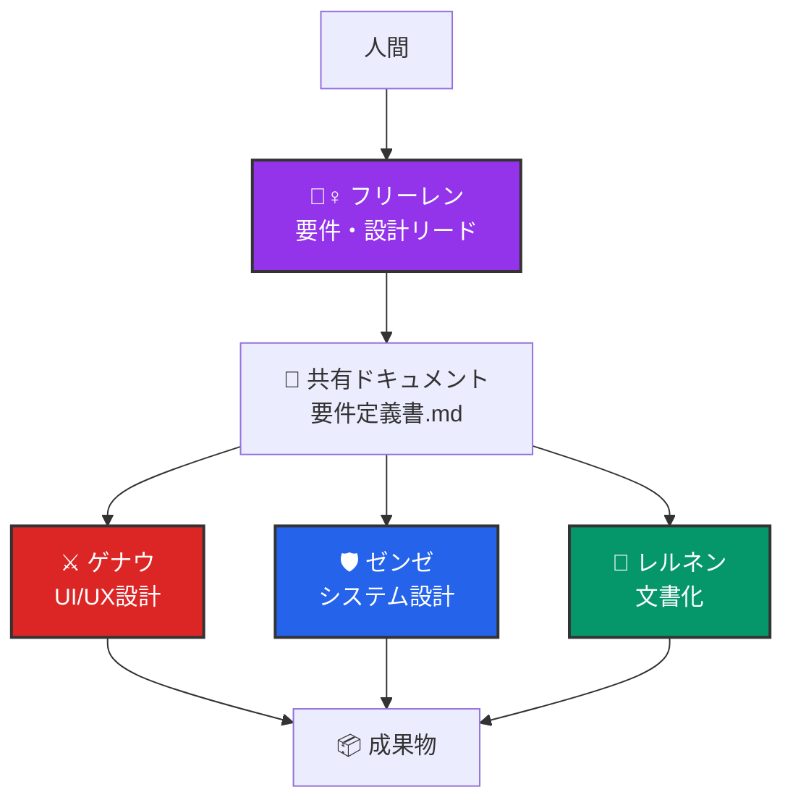

# 🎭 Requirements Engineering MultiAgent System v2.0

[](https://opensource.org/licenses/MIT)
[](https://claude.ai/code)
[](./docs/getting-started.md)

AI協調型要件定義・設計システム - フリーレンチームがあなたのプロジェクトを要件定義から設計まで支援します

## 🌟 概要

Requirements Engineering MultiAgent System は、Claude Code と Git Worktree を活用した革新的な要件定義自動化システムです。**フリーレンチーム**（一級魔法使い試験官）があなたのプロジェクトの要件定義から設計までを協力して進めます。

### 🎯 なぜこのシステムが必要か？

#### 企業が直面する課題
- **暗黙知の属人化**: ベテランの経験が文書化されずに失われる
- **要件定義の失敗**: プロジェクト失敗の60-70%は要件定義の不備が原因
- **品質のばらつき**: 担当者により要件定義書の品質が大きく変動

#### このシステムの価値
- **AIによる暗黙知の形式化**: ベストプラクティスを自動的に適用
- **多視点での検証**: 複数のAIエージェントが異なる観点から要件を精査
- **将来的な拡張性**: Git Worktreeにより異なるAI（Claude、GPT-4、Gemini等）の統合が可能

### 🎭 フリーレンチームの紹介

- **🧙‍♀️ フリーレン** - 要件・設計リード  
  *「で、何が欲しいの」* - ぶっきらぼうだが1000年の経験で本質を見抜く
  
- **⚔️ ゲナウ** - UI/UX設計  
  *「甘い考えは捨てろ」* - 厳格で合理的、妥協しない品質基準
  
- **🛡️ ゼンゼ** - システム設計・実装  
  *「平和的に解決しましょう」* - 平和主義者だが技術的には一切妥協しない
  
- **📜 レルネン** - 文書化  
  *「皆様の知見を整理させていただきます」* - 物腰柔らかい老紳士、慎重で完璧主義

## 🚀 クイックスタート（3分）

```bash
# 1. リポジトリをクローン
git clone https://github.com/username/requirements-engineering-multiagent.git
cd requirements-engineering-multiagent

# 2. サンプルプロジェクトで開始
cd examples/sample-web-service
./setup.sh

# 3. フリーレンチームを選択してプロジェクト作成
# → 対話形式でチーム選択とプロジェクト設定
```

## 💡 主な特徴

### 🤖 AI駆動の自動化
- Claude Code の高度な対話能力を活用
- Git Worktree による並行作業実現
- キャラクター性を持った自然な対話

### 🎯 高品質な成果物
- 構造化された要件定義書
- 実装可能なAPI仕様書
- インタラクティブなUIモックアップ
- 完全な開発ドキュメント

### 🔧 カスタマイズ可能
- キャラクターチームの選択
- 独自キャラクターの追加
- プロジェクトテンプレートの拡張

## 📋 生成される成果物

### 要件定義フェーズ
```
my-project/
├── shared/
│   └── 要件定義書.md          # ビジネス要件・ユーザー要件
├── sync/                      # エージェント間の進捗共有
└── output/                    # 各エージェントの成果物
```

### 設計フェーズ（拡張）
```
設計と開発フェーズのためのもの/設計フェーズ/projects/my-project/
├── architecture/
│   └── system-architecture.md # システムアーキテクチャ設計
├── api/
│   └── openapi.yaml          # OpenAPI 3.0 準拠のAPI仕様
├── database/
│   └── database-design.md    # ER図・テーブル定義
└── ui/
    └── ui-design.md          # UIコンポーネント設計
```

## 🏗️ アーキテクチャ



## 🎯 ユースケース

### こんなプロジェクトに最適
- 🌐 Webサービスの新規開発
- 📱 モバイルアプリの企画
- 🏢 社内システムの要件定義
- 🔄 既存システムのリニューアル

### こんな方におすすめ
- 要件定義の経験が浅い開発者
- 短期間で高品質な仕様書が必要なチーム
- AI活用に興味があるプロジェクトマネージャー
- 楽しく要件定義を進めたい方

## 🔄 開発チームへの連携

### 設計完了後の開発フェーズ移行
```bash
# 設計仕様を開発チームにエクスポート
cd 設計と開発フェーズのためのもの/統合ツール
./export-to-development.sh --dev-project ../../../development-engineering-multiagent/my-project
```

### 統合スクリプト
- `requirements-to-design.sh` - 要件定義から設計フェーズへ
- `export-to-development.sh` - 設計から開発チームへ

## 📚 ドキュメント

- [🚀 Getting Started](./docs/getting-started.md) - フリーレンチームとの最初の一歩
- [📖 チュートリアル](./docs/tutorials/) - 実践的な使い方ガイド
- [💡 ベストプラクティス](./docs/best-practices/) - 効果的な活用方法
- [🔧 トラブルシューティング](./docs/troubleshooting/) - よくある問題と解決法

## 🤝 コントリビューション

新しいキャラクターチームやテンプレートの追加を歓迎します！
詳細は [CONTRIBUTING.md](./CONTRIBUTING.md) をご覧ください。

### 貢献の方法
- 🎭 新キャラクターの提案
- 📋 テンプレートの改善
- 🐛 バグ報告
- 📚 ドキュメントの改善

## 📄 ライセンス

このプロジェクトは [MIT License](./LICENSE) のもとで公開されています。

## 🙏 謝辞

- Claude Code チーム - 素晴らしいAIエージェント機能の提供
- フリーレンファンコミュニティ - キャラクター性の参考
- 初期テスターの皆様 - 貴重なフィードバック

## 📞 サポート

- 📧 Issues: [GitHub Issues](https://github.com/username/requirements-engineering-multiagent/issues)
- 💬 Discussions: [GitHub Discussions](https://github.com/username/requirements-engineering-multiagent/discussions)
- 📖 Wiki: [Project Wiki](https://github.com/username/requirements-engineering-multiagent/wiki)

---

*「長い旅の始まりだ。でも、きっといい要件定義ができるよ」 - フリーレン*

<p align="center">
  Made with ❤️ by the Requirements Engineering Community
</p>