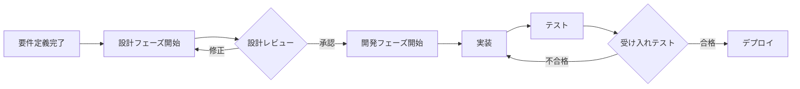

# 🛠️ 設計と開発フェーズのためのツール

このディレクトリには、要件定義フェーズ（フリーレンチーム）の後に続く、設計・開発フェーズ用のツールとテンプレートが含まれています。

## 📋 概要

要件定義が完了した後、以下の2つのフェーズに進みます：

1. **設計フェーズ** - アーキテクチャ、API、データベース、UIの詳細設計
2. **開発フェーズ** - 実際のコード実装、テスト、デプロイメント

## 🏗️ ディレクトリ構造

```
設計と開発フェーズのためのもの/
├── 設計フェーズ/
│   ├── アーキテクチャ設計/    # システム全体の設計
│   ├── API設計/              # API仕様とインターフェース設計
│   ├── データベース設計/       # データモデルとスキーマ設計
│   └── UI設計/               # 詳細なUI/UXデザイン
├── 開発フェーズ/
│   ├── コード生成テンプレート/  # 自動コード生成用テンプレート
│   ├── テスト仕様/            # テストケースとテスト計画
│   ├── デプロイメント設定/     # CI/CDとインフラ設定
│   └── 開発ガイドライン/       # コーディング規約と開発手順
└── 統合ツール/               # フェーズ間の連携ツール
```

## 🎭 設計フェーズエージェント（提案）

### 設計チーム構成

1. **システムアーキテクト**
   - 全体設計の責任者
   - 技術選定とアーキテクチャパターン決定
   - 非機能要件の実現方法設計

2. **API設計者**
   - RESTful/GraphQL API設計
   - エンドポイント定義
   - 認証・認可設計

3. **データベース設計者**
   - データモデリング
   - 正規化/非正規化判断
   - パフォーマンス最適化

4. **UI/UX詳細設計者**
   - コンポーネント詳細設計
   - インタラクション設計
   - アクセシビリティ考慮

## 💻 開発フェーズエージェント（提案）

### 開発チーム構成

1. **フロントエンド開発者**
   - UI実装
   - 状態管理
   - API連携

2. **バックエンド開発者**
   - ビジネスロジック実装
   - データアクセス層
   - API実装

3. **テストエンジニア**
   - テストケース作成
   - 自動テスト実装
   - 品質保証

4. **DevOpsエンジニア**
   - CI/CDパイプライン
   - インフラ構築
   - デプロイメント自動化

## 🔄 ワークフロー



## 🚀 使い方

### 1. 要件定義の成果物を取り込む

```bash
# 要件定義の成果物をインポート
./統合ツール/import-requirements.sh \
  --source ../../my-project/output/ \
  --target ./current-project/
```

### 2. 設計フェーズの開始

```bash
# 設計エージェントのセットアップ
cd 設計フェーズ
./setup-design-agents.sh
```

### 3. 開発フェーズの開始

```bash
# 開発エージェントのセットアップ
cd 開発フェーズ
./setup-dev-agents.sh
```

## 📊 成果物の例

### 設計フェーズの成果物
- システムアーキテクチャ図
- API仕様書（OpenAPI）
- ER図とデータベーススキーマ
- 詳細UIデザインとプロトタイプ

### 開発フェーズの成果物
- 実装済みソースコード
- 単体/統合テスト
- デプロイメント設定
- 運用ドキュメント

## 🔗 フリーレンチームとの連携

要件定義チーム（フリーレン、ゲナウ、ゼンゼ、レルネン）の成果物を基に：

1. **フリーレンの要件** → システムアーキテクチャ設計
2. **ゲナウのUI設計** → 詳細UIコンポーネント設計
3. **ゼンゼのシステム設計** → 技術実装詳細
4. **レルネンの文書** → 開発ドキュメント基盤

## 📝 注意事項

- このツールセットは要件定義システムの拡張として設計されています
- 各フェーズのエージェントは独立して動作しますが、密接に連携します
- 生成されるコードは必ず人間によるレビューが必要です

---

*「要件定義ができたら、次は設計と実装。まだまだ長い旅は続く」 - フリーレン*