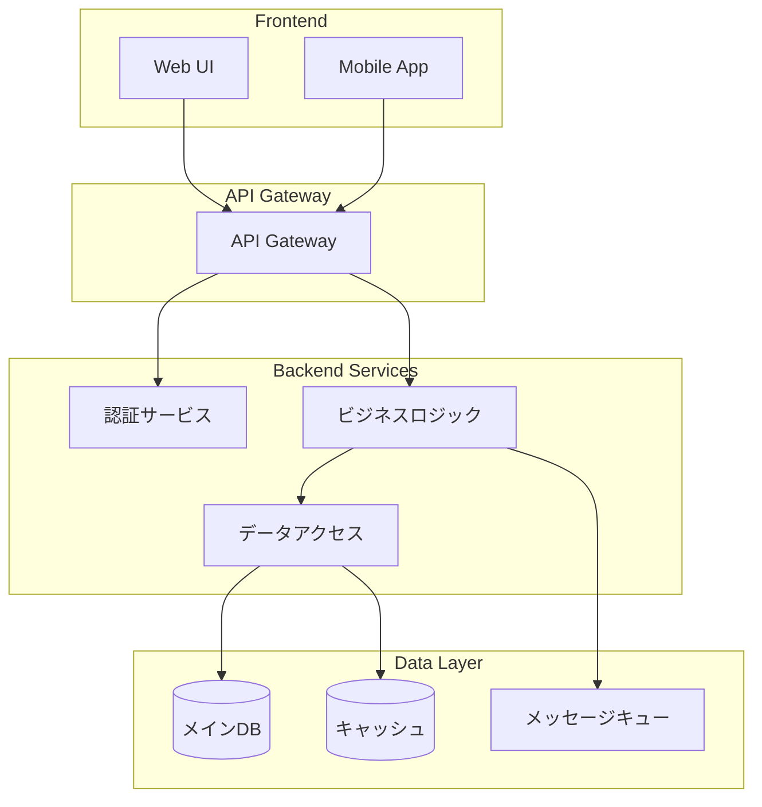
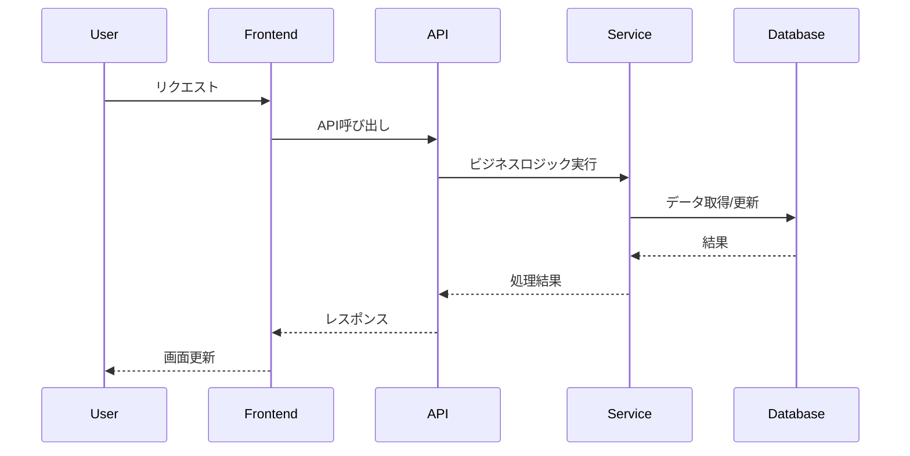
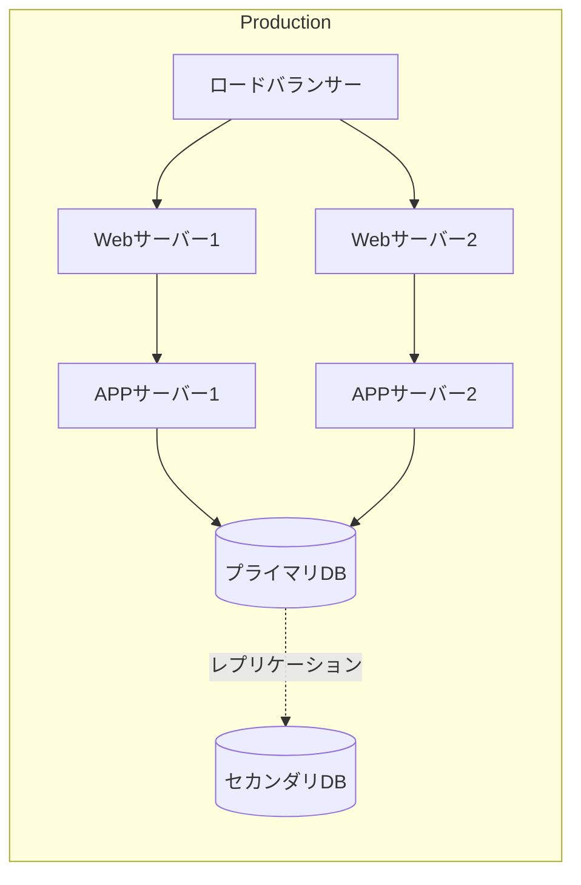

# システムアーキテクチャ設計書

## プロジェクト情報
- **プロジェクト名**: {{PROJECT_NAME}}
- **バージョン**: 1.0.0
- **作成日**: {{DATE}}
- **作成者**: システムアーキテクト

## 1. アーキテクチャ概要

### 1.1 アーキテクチャパターン
- [ ] モノリシック
- [ ] マイクロサービス
- [ ] サーバーレス
- [ ] イベントドリブン
- [ ] その他: 

### 1.2 システム構成図

## 2. 技術スタック

### 2.1 フロントエンド
- **フレームワーク**: 
- **状態管理**: 
- **UIライブラリ**: 
- **ビルドツール**: 

### 2.2 バックエンド
- **言語**: 
- **フレームワーク**: 
- **ランタイム**: 

### 2.3 データベース
- **メインDB**: 
- **キャッシュ**: 
- **検索エンジン**: 

### 2.4 インフラストラクチャ
- **クラウドプロバイダー**: 
- **コンテナ**: 
- **オーケストレーション**: 
- **CI/CD**: 

## 3. 非機能要件の実現

### 3.1 パフォーマンス
- **目標レスポンスタイム**: 
- **想定同時接続数**: 
- **スケーリング戦略**: 

### 3.2 可用性
- **目標稼働率**: 
- **冗長化**: 
- **障害対策**: 

### 3.3 セキュリティ
- **認証方式**: 
- **認可**: 
- **暗号化**: 
- **監査ログ**: 

### 3.4 保守性
- **ログ収集**: 
- **モニタリング**: 
- **アラート**: 

## 4. データフロー

### 4.1 主要なデータフロー

## 5. デプロイメントアーキテクチャ

### 5.1 環境構成
- **開発環境**: 
- **ステージング環境**: 
- **本番環境**: 

### 5.2 デプロイメント図

## 6. 技術的な判断と根拠

### 6.1 アーキテクチャ選定理由
<!-- なぜこのアーキテクチャを選んだか -->

### 6.2 技術スタック選定理由
<!-- 各技術の選定理由 -->

### 6.3 トレードオフ
<!-- 採用しなかった選択肢とその理由 -->

## 7. リスクと対策

| リスク | 影響度 | 発生確率 | 対策 |
|--------|--------|----------|------|
|        | 高/中/低 | 高/中/低  |      |

## 8. 移行計画（既存システムがある場合）

### 8.1 移行戦略
- [ ] ビッグバン移行
- [ ] 段階的移行
- [ ] 並行稼働

### 8.2 移行ステップ
1. 
2. 
3. 

## 9. 今後の拡張性

### 9.1 想定される拡張
- 
- 

### 9.2 拡張のための準備
- 
- 

---
*このドキュメントは要件定義書を基に作成されました*
*最終更新: {{LAST_UPDATED}}*