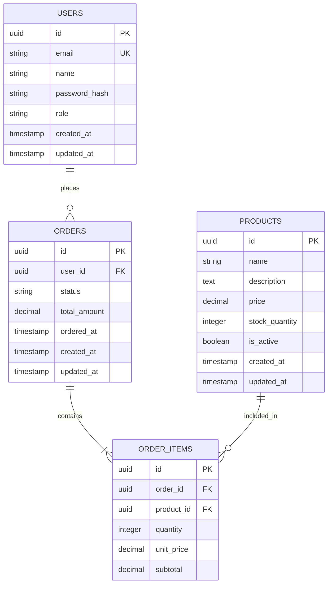

# データベース設計書

## プロジェクト情報
- **プロジェクト名**: {{PROJECT_NAME}}
- **バージョン**: 1.0.0
- **作成日**: {{DATE}}
- **作成者**: DB設計者（ゼンゼの設計を詳細化）

## 1. データベース概要

### 1.1 データベース選定
- **種類**: PostgreSQL / MySQL / MongoDB / その他
- **バージョン**: 
- **選定理由**: 

### 1.2 設計方針
- [ ] 正規化重視（OLTP）
- [ ] パフォーマンス重視（一部非正規化）
- [ ] 分析用途（OLAP）
- [ ] NoSQL（ドキュメント/KVS）

## 2. ER図



## 3. テーブル定義

### 3.1 users（ユーザー）
| カラム名 | データ型 | NULL | デフォルト | 説明 |
|----------|----------|------|------------|------|
| id | UUID | NO | gen_random_uuid() | 主キー |
| email | VARCHAR(255) | NO | - | メールアドレス（一意） |
| name | VARCHAR(100) | NO | - | ユーザー名 |
| password_hash | VARCHAR(255) | NO | - | パスワードハッシュ |
| role | VARCHAR(20) | NO | 'user' | ロール |
| created_at | TIMESTAMP | NO | CURRENT_TIMESTAMP | 作成日時 |
| updated_at | TIMESTAMP | NO | CURRENT_TIMESTAMP | 更新日時 |

**インデックス**:
- PRIMARY KEY (id)
- UNIQUE INDEX idx_users_email (email)
- INDEX idx_users_created_at (created_at)

### 3.2 products（商品）
| カラム名 | データ型 | NULL | デフォルト | 説明 |
|----------|----------|------|------------|------|
| id | UUID | NO | gen_random_uuid() | 主キー |
| name | VARCHAR(200) | NO | - | 商品名 |
| description | TEXT | YES | NULL | 商品説明 |
| price | DECIMAL(10,2) | NO | - | 価格 |
| stock_quantity | INTEGER | NO | 0 | 在庫数 |
| is_active | BOOLEAN | NO | true | 有効フラグ |
| created_at | TIMESTAMP | NO | CURRENT_TIMESTAMP | 作成日時 |
| updated_at | TIMESTAMP | NO | CURRENT_TIMESTAMP | 更新日時 |

## 4. マイグレーション計画

### 4.1 初期マイグレーション
```sql
-- 001_create_users_table.sql
CREATE TABLE users (
    id UUID PRIMARY KEY DEFAULT gen_random_uuid(),
    email VARCHAR(255) NOT NULL UNIQUE,
    name VARCHAR(100) NOT NULL,
    password_hash VARCHAR(255) NOT NULL,
    role VARCHAR(20) NOT NULL DEFAULT 'user',
    created_at TIMESTAMP NOT NULL DEFAULT CURRENT_TIMESTAMP,
    updated_at TIMESTAMP NOT NULL DEFAULT CURRENT_TIMESTAMP
);

CREATE INDEX idx_users_email ON users(email);
CREATE INDEX idx_users_created_at ON users(created_at);
```

## 5. パフォーマンス考慮

### 5.1 インデックス戦略
- 主キーは全てUUIDを使用
- 検索頻度の高いカラムにインデックス
- 複合インデックスは必要に応じて追加

### 5.2 パーティショニング
- 大規模データの場合は日付でパーティショニング
- アーカイブ戦略の検討

### 5.3 正規化レベル
- 基本的に第3正規形まで
- パフォーマンスのため一部非正規化を許容

## 6. セキュリティ考慮

### 6.1 アクセス制御
- アプリケーション用ユーザーの権限は最小限
- 個人情報カラムは暗号化を検討

### 6.2 監査ログ
- 重要テーブルには監査ログテーブルを用意
- トリガーによる自動記録

## 7. バックアップとリカバリ

### 7.1 バックアップ方針
- 日次フルバックアップ
- トランザクションログの定期バックアップ

### 7.2 リカバリ手順
- ポイントインタイムリカバリ対応
- 災害復旧計画

## 8. 将来の拡張性

### 8.1 想定される拡張
- マルチテナント対応
- 読み取り専用レプリカ
- シャーディング

### 8.2 スキーマバージョン管理
- マイグレーションツールの使用
- ロールバック可能な設計

---
*このドキュメントは要件定義書とシステム設計を基に作成されました*
*フリーレンチームの要件を実現するための詳細設計です*